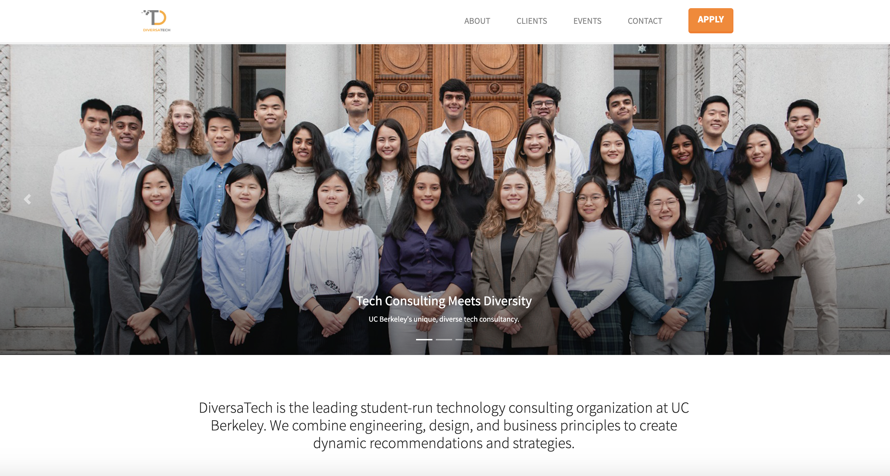

[![Contributors][contributors-shield]][contributors-url]
[![Forks][forks-shield]][forks-url]
[![Stargazers][stars-shield]][stars-url]
[![Issues][issues-shield]][issues-url]
[![MIT License][license-shield]][license-url]


<!-- PROJECT LOGO -->
<br />
<p align="center">
  
  <a href="http://diversatech.org/">	
    	
  </a>

  <h3 align="center">DiversaTech</h3>

  <p align="center">
    DiversaTech is UC Berkeley's premier tech consultancy student-run organization that combines both engineering and business principles to create dynamic recommendations and strategies for our clients.
    <br />
    <br />
    <a href="https://github.com/DiversaTech/diversatech.github.io/"><strong>Explore the docs »</strong></a>
    <br />
    <br />
    <a href="http://diversatech.org/">View Demo</a>
    ·
    <a href="https://github.com/DiversaTech/diversatech.github.io/issues">Report Bug</a>
    ·
    <a href="https://github.com/DiversaTech/diversatech.github.io/issues">Request Feature</a>
  </p>
</p>


<!-- TABLE OF CONTENTS -->
<details open="open">
  <summary><h2 style="display: inline-block">Table of Contents</h2></summary>
  <ol>
    <li>
      <a href="#about-the-project">About The Project</a>
    </li>
    <li>
      <a href="#getting-started">Getting Started</a>
      <ul>
        <li><a href="#prerequisites">Prerequisites</a></li>
        <li><a href="#installation">Installation</a></li>
        <li><a href="#structure">File Structure</a></li>
      </ul>
    </li>
    <li><a href="#license">License</a></li>
    <li><a href="#contact">Contact</a></li>
  </ol>
</details>


<!-- ABOUT THE PROJECT -->
## About The Project

A central aspect of DiversaTech’s mission is to build an inclusive community in order to foster collaboration and develop consulting skills throughout campus. Instead of rejecting applicants who do not fully meet the qualifications to be tech consultants, we have developed an educational branch of our organization that exposes students to a foundation of consulting practices and current trends in technology. We see this as a development pipeline that gives students an opportunity to apply the creative and analytical skills they learn in the classroom to real world problems. In doing this, we hope to prepare more individuals to work on our consulting projects in the future and see this as the best way to pay our skills forward.


<!-- GETTING STARTED -->
## Getting Started

To get a local copy up on your own computer and running follow these simple steps.

### Prerequisites

1. N/A

### Installation

1. Clone the repo
   ```sh
   git clone https://github.com/DiversaTech/diversatech.github.io
   ```
2. Create your feature branch
   ```sh
   git checkout -b feature/AmazingFeature
   ```
3. Commit your changes
    ```sh
    git commit -m 'Add some AmazingFeature'
    ```
4. Push to the branch
    ```sh
    git push origin feature/AmazingFeature
    ```
5. Open a pull request on Github


### Structure

Do not make changes to any other folders or files not listed below.

    .
    ├── ...
    ├── css                     # CSS styles
    │   ├── custom.css          # custom stylesheet
    │   ├── footer.css          # footer
    │   ├── nav.css             # header navbar
    │   └── timeline.css        # timeline graphic on Apply page       
    ├── img                     # Images folder
    |   ├── companies           # Client logos for each semester on Clients page
    │   ├── flyer               # Recruitment flyers for each semester
    │   ├── leadership          # Profile pictures of leadership team on About page
    │   ├── logo                # DiversaTech logo
    |   ├── social              # Club social pictures for Apply page
    |   ├── sponsors            # Sponsor logos on home page
    │   └── ...                 # other home page images
    ├── js                      # JS scripts
    |   └── custom.js           # custom scripts
    ├── index.html              # Home page
    ├── nav.html                # Header navbar
    ├── footer.html             # Footer
    ├── about.html              # About page
    ├── clients.html            # Clients page
    ├── events.html             # Events page
    ├── contact.html            # Contact page
    ├── apply.html              # Apply page
    ├── faq.html                # FAQ page
    ├── recruitment.html        # Recruitment Guide
    └── ...


<!-- LICENSE -->
## License

This project is under the MIT License.


<!-- CONTACT -->
## Contact

DiversaTech - [Email](diversatech.berkeley@gmail.com)

Julia Liu - [Email](juliasliu@berkeley.edu)

Project Link: [https://github.com/DiversaTech/diversatech.github.io/](https://github.com/DiversaTech/diversatech.github.io/)


<!-- MARKDOWN LINKS & IMAGES -->
<!-- https://www.markdownguide.org/basic-syntax/#reference-style-links -->
[contributors-shield]: https://img.shields.io/github/contributors/DiversaTech/diversatech.github.io.svg?style=for-the-badge
[contributors-url]: https://github.com/DiversaTech/diversatech.github.io/graphs/contributors
[forks-shield]: https://img.shields.io/github/forks/DiversaTech/diversatech.github.io.svg?style=for-the-badge
[forks-url]: https://github.com/DiversaTech/diversatech.github.io/network/members
[stars-shield]: https://img.shields.io/github/stars/DiversaTech/diversatech.github.io.svg?style=for-the-badge
[stars-url]: https://github.com/DiversaTech/diversatech.github.io/stargazers
[issues-shield]: https://img.shields.io/github/issues/DiversaTech/diversatech.github.io.svg?style=for-the-badge
[issues-url]: https://github.com/juliasliu/application/issues
[license-shield]: https://img.shields.io/github/license/DiversaTech/diversatech.github.io.svg?style=for-the-badge
[license-url]: https://github.com/DiversaTech/diversatech.github.io/blob/master/LICENSE.txt
